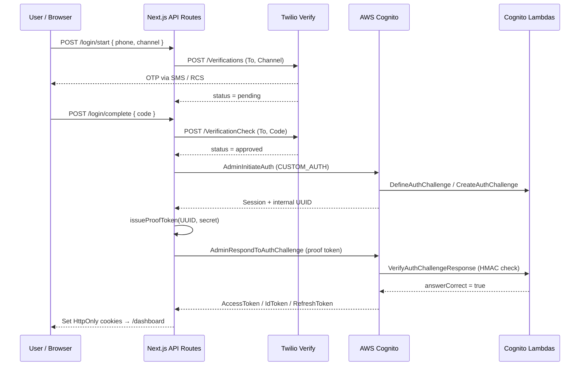

# OTP Login Demo — Twilio Verify (SMS / RCS) × AWS Cognito

A Next.js 14 application that authenticates users with a **one-time passcode over SMS or RCS** — no passwords. It combines the **Twilio Verify API** (code generation, delivery, TTL, attempt counting, fraud controls) with the **AWS Cognito Custom Auth Flow** (account management and JWT session token issuance).

> Adapted for Rathbones from the original passkey demo. The Cognito custom-auth bridge and Lambda triggers are unchanged; the Twilio layer now uses Verify's `Verifications` / `VerificationCheck` endpoints, and the UI collects a phone number + OTP instead of a WebAuthn credential. Switching a verification from SMS to RCS is a single `Channel` parameter.

## Architecture

```
Browser (phone number + OTP)
  ↕
Next.js API Routes (orchestrator)
  ↕                ↕
Twilio Verify      AWS Cognito
(send OTP +        (account management +
 check code)        session token issuance)
                     ↕
                   Lambda x3
                   (HMAC proof token verification)
```

**How it works:**

1. **Twilio Verify** sends the OTP (`POST /Verifications` with `Channel=sms` or `Channel=rcs`) and validates the code the user types (`POST /VerificationCheck`). Twilio owns code generation, TTL, attempt counting and fraud signals.
2. **AWS Cognito** manages user accounts and issues JWT session tokens (AccessToken, IdToken, RefreshToken) via the Custom Auth Flow.
3. **Next.js API Routes** orchestrate between Twilio and Cognito. After Verify returns `approved`, the app mints a short-lived **HMAC proof token** and submits it to Cognito as evidence that verification succeeded — the OTP itself never reaches Cognito.
4. **Lambda triggers** verify that HMAC proof token inside Cognito's Custom Auth Flow.
5. **middleware.ts** validates the Cognito JWT on protected routes (`/dashboard`).

## Why this matters for an OTP migration

If you generate and validate codes in-house today (e.g. via AWS SNS / End User Messaging), Verify lets you **rip out** code generation, TTL handling, retry logic, per-region sender provisioning and fraud detection — it's two API calls. Adding a channel (RCS, WhatsApp, Voice) is a parameter change, not a re-architecture. Cognito stays as your IdP; only the OTP send/check calls move to Twilio.

## Tech Stack

| Purpose                    | Technology                               |
| -------------------------- | ---------------------------------------- |
| Frontend / API             | Next.js 14 (App Router)                  |
| Hosting                    | AWS App Runner                           |
| OTP delivery & verification| Twilio Verify (REST API: SMS / RCS)      |
| Account & Token Management | AWS Cognito User Pool (Custom Auth Flow) |
| Secret Management          | AWS Secrets Manager                      |
| JWT Verification           | jose                                     |
| Language                   | TypeScript                               |

## Setup

See [SETUP.md](./SETUP.md) for full instructions (Cognito user pool, Lambda triggers, Verify service).

### Quick Start

```bash
# Install dependencies
npm install

# Create the env file
cp .env.local.example .env.local
# Edit .env.local with your values

# Start the dev server
npm run dev
```

### Prerequisites

- Node.js 20+
- AWS CLI (configured)
- Twilio account with a Verify Service (SMS enabled; RCS enabled + an approved RCS sender if you want to demo RCS)
- AWS Cognito user pool with Custom Auth + the three Lambda triggers configured

### Environment Variables

| Variable                    | Description                                       |
| --------------------------- | ------------------------------------------------- |
| `TWILIO_ACCOUNT_SID`        | Twilio Account SID                                |
| `TWILIO_AUTH_TOKEN`         | Twilio Auth Token                                 |
| `TWILIO_VERIFY_SERVICE_SID` | Twilio Verify Service SID                         |
| `COGNITO_USER_POOL_ID`      | Cognito User Pool ID                              |
| `COGNITO_CLIENT_ID`         | Cognito app client ID                             |
| `VERIFY_PROOF_SECRET`       | HMAC secret shared with the verify Lambda         |
| `AWS_REGION`                | AWS region (e.g. `eu-west-1`)                     |

## Directory Structure

```
verify-otp-cognito/
├── app/
│   ├── (auth)/
│   │   ├── register/page.tsx          # Sign-up: phone + channel, then OTP
│   │   └── login/page.tsx             # Login: phone + channel, then OTP
│   ├── dashboard/page.tsx             # Authenticated dashboard
│   └── api/auth/
│       ├── register/start/route.ts    # Sends OTP (POST /Verifications)
│       ├── register/complete/route.ts # Checks OTP + bridges to Cognito
│       ├── login/start/route.ts       # Sends OTP (POST /Verifications)
│       ├── login/complete/route.ts    # Checks OTP + bridges to Cognito
│       └── logout/route.ts            # Clears session cookies
├── lib/
│   ├── twilio.ts                      # Verify API client (startVerification/checkVerification)
│   ├── cognito.ts                     # Cognito operations
│   ├── verify-proof.ts                # HMAC proof token issue/verify
│   ├── secrets.ts                     # Secret management
│   └── cookies.ts                     # Cookie helpers
├── lambda/
│   ├── define-auth-challenge.ts       # Cognito trigger: flow control
│   ├── create-auth-challenge.ts       # Cognito trigger: nonce generation
│   └── verify-auth-challenge.ts       # Cognito trigger: proof token verification
├── middleware.ts                      # JWT verification middleware
├── Dockerfile                         # Multi-stage build
└── apprunner.yaml                     # App Runner deploy config
```

## Authentication Flow

### Registration (account creation)

1. User enters their mobile number (E.164) and picks a channel (SMS or RCS).
2. Server calls `POST /Verifications` → Twilio sends the OTP on that channel.
3. User types the code.
4. Server calls `POST /VerificationCheck` → status `approved`.
5. Server creates a Cognito user (keyed on phone number) and initiates Custom Auth.
6. Server mints an HMAC proof token (30-second TTL) bound to Cognito's internal UUID.
7. Cognito Lambda verifies the proof token → Cognito issues session tokens.
8. Session tokens are stored in HttpOnly cookies → redirect to dashboard.

### Login

1. User enters their mobile number and picks a channel.
2. Server calls `POST /Verifications` → Twilio sends the OTP.
3. User types the code.
4. Server calls `POST /VerificationCheck` → status `approved`.
5. Server initiates Cognito Custom Auth and mints the HMAC proof token.
6. Cognito Lambda verifies the proof token → Cognito issues session tokens.
7. Session tokens are stored in HttpOnly cookies → redirect to dashboard.

## Sequence Diagram (login)



## Key Design Decisions

- **No password authentication**: the Cognito app client allows only `ALLOW_CUSTOM_AUTH` and `ALLOW_REFRESH_TOKEN_AUTH`. Users are created with random permanent passwords nobody knows.
- **OTP never reaches Cognito**: Twilio verifies the code; Cognito only ever sees the HMAC proof token. This keeps the OTP secret on the Twilio side and makes the Cognito challenge channel-agnostic.
- **Cognito internal UUID**: with phone-number-as-username, Cognito's internal `userName` is a UUID. The HMAC proof token must use this UUID (from the `AdminInitiateAuth` response) so it matches `event.userName` in the Lambda.
- **Admin API required**: auth is initiated with `AdminInitiateAuth`, so the challenge response uses `AdminRespondToAuthChallengeCommand`.
- **SMS vs RCS is one parameter**: `startVerification(to, channel)` only changes `Channel`. Verify handles RCS capability detection and fallback service-side; RCS requires the channel to be enabled on the Verify Service and an approved RCS sender.
- **Twilio REST API instead of SDK**: the demo calls Verify's `/Verifications` and `/VerificationCheck` endpoints directly via `fetch` with form-encoded bodies — no SDK dependency in the request path.

## Deploy

### Docker build

```bash
docker build -t verify-otp-cognito .
```

### App Runner

Deploy with `apprunner.yaml`. In production, `TWILIO_AUTH_TOKEN` and `VERIFY_PROOF_SECRET` are read from Secrets Manager. See [SETUP.md](./SETUP.md) section 7.

## Building and deploying the Lambdas

```bash
cd lambda
npm init -y
npm install @types/aws-lambda typescript
npx tsc

cd dist
zip define-auth-challenge.zip define-auth-challenge.js
zip create-auth-challenge.zip create-auth-challenge.js
zip verify-auth-challenge.zip verify-auth-challenge.js
```

See [SETUP.md](./SETUP.md) section 3 for the full Lambda + Cognito trigger wiring.
